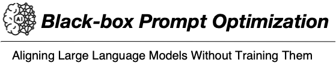
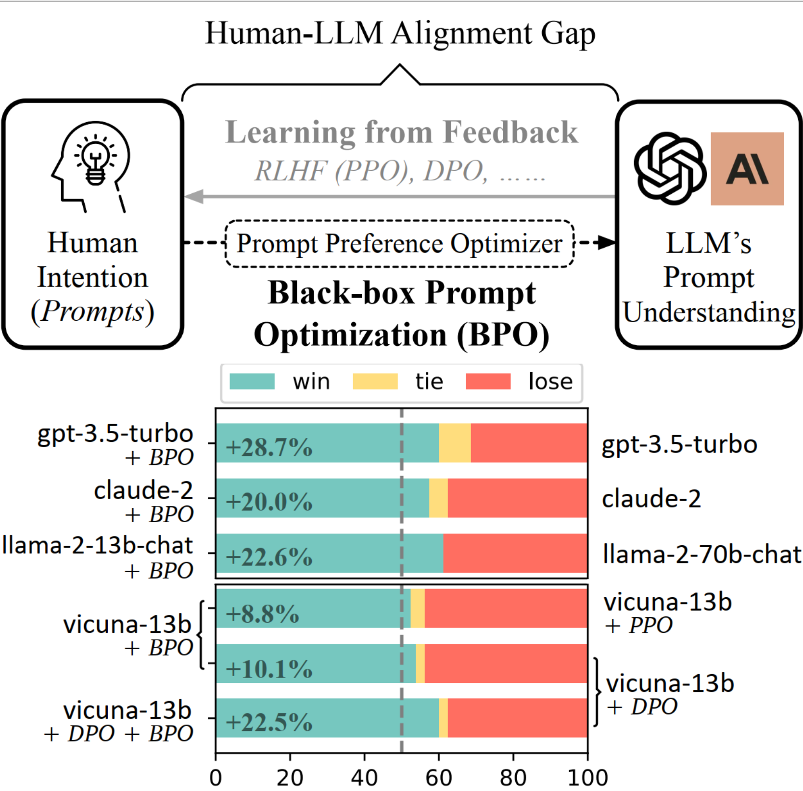

<!-- <div align="center"> -->
<!--  -->
<!-- </div> -->
# Black-Box Prompt Optimization (BPO)
### Aligning Large Language Models without Model Training (ACL 2024)

<p align="center">
   🤗 <a href="#model" target="_blank">Model</a> • 📚 <a href="#data" target="_blank">Data</a> • 📃 <a href="https://arxiv.org/abs/2311.04155" target="_blank">Paper</a> • 🌐 <a href="https://huggingface.co/spaces/CCCCCC/BPO_demo" target="_blank">Demo</a>
</p>

(Upper) Black-box Prompt Optimization (BPO) offers a conceptually new perspective to bridge the gap between humans and LLMs. (Lower) On Vicuna Eval’s pairwise evaluation, we show that BPO further aligns gpt-3.5-turbo and claude-2 without training. It also outperforms both PPO & DPO and presents orthogonal improvements.

<div align="center">

</div>

<br>
<br>

## Update
We have released our [model](https://huggingface.co/THUDM/BPO) and [data](https://huggingface.co/datasets/THUDM/BPO) on Hugging Face.

We build a [demo](https://huggingface.co/spaces/CCCCCC/BPO_demo) for BPO on Hugging Face.
<br>

## Table of Contents
- [Model](#model)
- [Data](#data)
- [Quick Start](#quick-start)
    - [Data Construction](#data-construction)
    - [Model Training](#model-training)
    - [Inference](#inference)
    - [Evaluation](#evaluation)
- [Citation](#citation)


## Model
The prompt preference optimization model can be download from [Hugging Face](https://huggingface.co/THUDM/BPO)

Inference code (Please refer to [src/infer_example.py](src/infer_example.py) for more instructions on how to optimize your prompts):
```python
from transformers import AutoModelForCausalLM, AutoTokenizer

model_path = 'THUDM/BPO'

prompt_template = "[INST] You are an expert prompt engineer. Please help me improve this prompt to get a more helpful and harmless response:\n{} [/INST]"

device = 'cuda:0'
model = AutoModelForCausalLM.from_pretrained(model_path).half().eval().to(device)
# for 8bit
# model = AutoModelForCausalLM.from_pretrained(model_path, device_map=device, load_in_8bit=True)
tokenizer = AutoTokenizer.from_pretrained(model_path)

text = 'Tell me about Harry Potter'

prompt = prompt_template.format(text)
model_inputs = tokenizer(prompt, return_tensors="pt").to(device)
output = model.generate(**model_inputs, max_new_tokens=1024, do_sample=True, top_p=0.9, temperature=0.6, num_beams=1)
resp = tokenizer.decode(output[0], skip_special_tokens=True).split('[/INST]')[1].strip()

print(resp)
```

## Data

### BPO dataset
BPO Dataset can be found on [Hugging Face](https://huggingface.co/datasets/THUDM/BPO).

### BPO for SFT Data Construction 
The alpaca_reproduce directory contains the BPO-reproduced Alpaca dataset. The data format is:
```json
{
    "instruction": {instruction},
    "input": {input},
    "output": {output},
    "optimized_prompt": {optimized_prompt},
    "res": {res}
}
```
- {instruction}, {input}, and {output} are elements from the original dataset.
- {optimized_prompt} is BPO-optimized instruction.
- {res} is the response from text-davinci-003 using the {optimized_prompt}.


### Testset
The testset directory contains all the test datasets we used, including: 
- 200 prompts sampled from the BPO dataset
- 200 examples from Dolly dataset
- 252 human evaluation instructions from Self-Instruct
- 80 user-oriented prompts from the Vicuna Eval dataset.


## Quick Start
For all codes, we have added `#TODO` comments to indicate places in the code that need modification before running. Please update the relevant parts as noted before executing each file.

### Setup
```bash
pip install -r requirements.txt
```

### Data Construction
To construct data yourself, run the following command
```bash
cd src/data_construction

# using pairwise feedback data to generate optimized prompts
python chatgpt_infer.py

# process generated optimized prompts
python process_optimized_prompts.py
```

### Model Training
If you want to train your own prompt preference optimizer, 
please run the following command:
```bash
cd src/training

# pre-process fine-tuning data
python ../data_construction/process_en.py
python data_utils.py

# fine-tuning
python train.py

# inference
python infer_finetuning.py
```

### Inference
We show an [example code](src/inference/llama2_infer.py) for generation with llama2-chat on BPO-optimized prompts.

### Evaluation
If you wish to compare the BPO-aligned model with the original model, please refer to the following code:
```bash
cd src/evaluation

# take gpt4 evaluation on dolly_eval as an example
python gpt4_score.py --input_file_a "Path to generation results of BPO-aligned model" \
--input_file_b "Path to generation results of original model" \
--task_name "dolly_eval" \ # change it to "self_instruct", "test_set", or "vicuna_eval" for other testsets
--output_file "Output path"

# calculate win rates
python cal_gpt4_score.py --input_file "Output path"
```


## Acknowledgement
- Fine-tuning code: [llm_finetuning](https://github.com/ssbuild/llm_finetuning)
- PPO code: [DeepSpeed-Chat](https://github.com/microsoft/DeepSpeedExamples/blob/master/applications/DeepSpeed-Chat/README.md)
- DPO code: [LLaMA-Factory](https://github.com/hiyouga/LLaMA-Factory)
- Evaluation Prompts: [llm_judge](https://github.com/lm-sys/FastChat/tree/main/fastchat/llm_judge) and [alpaca_eval](https://github.com/tatsu-lab/alpaca_eval)

## Citation
```
@article{cheng2023black,
  title={Black-Box Prompt Optimization: Aligning Large Language Models without Model Training},
  author={Cheng, Jiale and Liu, Xiao and Zheng, Kehan and Ke, Pei and Wang, Hongning and Dong, Yuxiao and Tang, Jie and Huang, Minlie},
  journal={arXiv preprint arXiv:2311.04155},
  year={2023}
}
```
